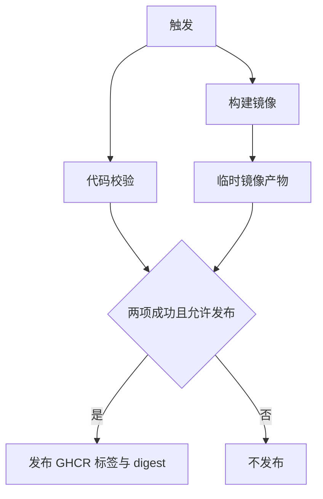

## 工作流概览

**用途**： 验证代码与应用镜像，并仅在校验成功后将同一镜像发布到 GitHub Container Registry（GHCR）。
**触发事件**： `main` 分支推送、`v*` 标签推送、拉取请求、手动触发。
**目标环境**： Linux AMD64 容器；不操作生产环境、数据库或部署状态。

## 执行流程图

## 任务与依赖

| 任务名称 | 用途 | 依赖 | 执行环境 |
| --- | --- | --- | --- |
| verify | 类型检查、静态检查、单元测试、应用构建 | 无 | Linux 托管运行器 |
| image | 构建运行镜像及来源元数据 | 无，与 verify 并行 | Linux AMD64 构建环境 |
| publish | 发布 image 的原始产物，不重新构建 | verify、image 均成功 | 具有包写入权限的 Linux 运行器 |

## 需求矩阵

### 功能需求

| ID | 需求 | 优先级 | 验收标准 |
| --- | --- | --- | --- |
| REQ-001 | 所有触发均验证代码与镜像构建 | High | 失败的校验或构建阻止发布 |
| REQ-002 | 仅主分支和版本标签允许发布 | High | PR、其他分支的手动运行均不登录或推送 GHCR |
| REQ-003 | 可追溯到源码提交 | High | 镜像含完整提交 SHA 标签、来源标签和同一 SHA 的诊断构建标识 |
| REQ-004 | 分支与版本标签互不污染 | High | main 发布 main/latest；版本发布对应 v 标签，不能改写 latest |
| REQ-005 | 发布同一构建产物 | High | 发布阶段只加载、重新标记并推送，不能重新编译 |
| REQ-006 | 支持不可变部署引用 | High | 成功运行摘要包含已推送的镜像标签和仓库 digest |

### 安全需求

| ID | 需求 | 实现约束 |
| --- | --- | --- |
| SEC-001 | 最小权限 | 默认只读仓库；仅 publish 允许写包 |
| SEC-002 | 不信任 PR 代码 | PR 无发布任务，不使用特权 PR 触发器 |
| SEC-003 | 不携带应用凭据 | 构建上下文沿用显式允许列表；构建只注入非敏感标识 |
| SEC-004 | 隔离发布凭据 | 发布任务不检出或执行项目代码；只使用平台短期令牌 |
| SEC-005 | 保持运行镜像边界 | 最终镜像仅含构建产物、生产依赖与迁移，使用非 root 用户 |

### 性能需求

| ID | 指标 | 目标 | 度量方式 |
| --- | --- | --- | --- |
| PERF-001 | 校验与镜像构建并行 | 无相互等待 | 运行任务时间线 |
| PERF-002 | 缓存复用 | 依赖按平台及锁文件隔离，镜像复用构建层 | 缓存命中日志 |
| PERF-003 | 过时 PR 运行 | 新运行取消同一 PR 的旧运行 | 两次 PR 更新的运行状态 |
| PERF-004 | 重复构建 | 每次运行只构建一次容器镜像 | 发布日志不含重新构建 |

## 输入/输出契约

- 输入：触发事件、Git 引用、完整提交 SHA、仓库源码、依赖锁文件及 Dockerfile。
- 镜像名称：`ghcr.io/<owner>/<repository>`，自动转为小写。
- 标签：`sha-<完整 SHA>`；主分支另有 `main`、`latest`；版本另有原始 `v*` 标签。
- 非发布事件生成元数据并验证构建，但不上传发布产物或推送标签。
- 中间产物：仅本次运行可消费的镜像归档，保留一天，不压缩。
- 最终输出：GHCR 镜像及运行摘要中的标签和 digest；无自动部署产物。

### 密钥与变量

| 类型 | 名称 | 用途 | 作用范围 |
| --- | --- | --- | --- |
| 自动令牌 | GITHUB_TOKEN | GHCR 登录及写包 | publish |
| 非敏感输入 | 提交 SHA | 诊断构建标识 | image |

无需额外 PAT、应用密钥或数据库凭据。组织或既有包的访问策略仍可能阻止发布。

## 执行约束

- verify / image / publish 的超时分别为 20 / 30 / 15 分钟。
- 同一工作流、同一 Git 引用使用一个并发组；只有 PR 会主动取消正在运行的旧任务。平台仍可能替换排队中的旧运行，不保证逐个发布每次推送。
- 托管运行器需访问代码托管、依赖仓库、基础镜像仓库、构建缓存、产物存储与 GHCR。
- 当前只承诺 Linux AMD64，不包含 ARM64 或多架构清单。

## 错误处理策略

| 错误类型 | 响应 | 恢复动作 |
| --- | --- | --- |
| 安装、检查、测试或构建失败 | 运行失败，不发布 | 修复后重新运行 |
| 产物上传或下载失败 | 发布失败或跳过 | 检查产物服务并重新运行；过期后需重跑构建 |
| GHCR 权限或网络失败 | 发布任务失败 | 修复权限或网络后重新运行 |
| 部分标签推送成功 | 保留已经写入的标签，不宣称发布原子性 | 重跑同次发布；生产仍按 digest 固定版本 |

## 质量门禁

类型检查、静态检查、单元测试、应用构建和真实容器构建均不得绕过。当前不包含镜像漏洞扫描门禁，也不声称镜像无已知漏洞。

## 监控与可观测性

- 任务日志用于检查失败、缓存命中和耗时；发布摘要提供标签和 digest。
- 通知与日志保留沿用仓库设置；不新增告警系统。
- 无历史运行基线，不承诺节省比例。缓存预计减少重复下载和编译；镜像归档会增加一次上传与下载开销。

## 集成点

- GitHub Actions：执行、令牌、缓存及临时产物存储。
- GHCR：保存应用镜像；包可见性由仓库维护者管理，不自动公开。
- 部署 CLI：操作者先按 digest 拉取镜像，再显式执行安装或更新。无依赖工作流自动触发生产操作。

## 合规与治理

所有工作流修改按仓库代码审查策略处理。发布授权取决于谁能修改 main、创建版本标签及触发运行；分支与标签保护由维护者配置。应用凭据始终只在运行时注入。

## 边界情况与例外

| 场景 | 预期行为 | 验证方式 |
| --- | --- | --- |
| Fork PR | 仅校验，不登录 GHCR | PR 运行图及日志 |
| 大写 owner/repository | 镜像名称转为小写 | 元数据输出 |
| 手动运行非主分支 | 构建但不发布 | 条件检查及运行图 |
| 预发布 v 标签 | 发布原标签，不覆盖 latest | 元数据输出 |
| 同一提交重跑 | 可覆盖 SHA 标签；标签不等于不可变引用 | 比较 digest；生产固定 digest |
| 未授权的既有 GHCR 包 | 明确失败，不回退到其他仓库 | 发布日志 |

## 验证标准

- VLD-001：工作流通过语法、表达式、权限与依赖关系检查。
- VLD-002：真实 Linux AMD64 镜像可构建、导出、加载，两个运维入口的只读检查返回一致构建标识。
- VLD-003：GitHub 实际运行确认授权事件推送 GHCR，PR 不推送；本地验证不能替代此项。
- PERF-005：缓存及并发收益须以实际运行时间线测量，不由配置推断为已实现的节省。

## 变更管理

先更新此行为契约，再修改工作流；本地验证后通过审查合并，并以实际 GitHub 运行确认发布与并发行为。

| 版本 | 日期 | 变更 | 作者 |
| --- | --- | --- | --- |
| 1.0 | 2026-09-19 | 初始构建与 GHCR 发布契约 | 仓库维护者 |

## 相关规格

- [工作流](../.github/workflows/build.yml)
- [部署、维护与故障恢复](../docs/deployment.md)
